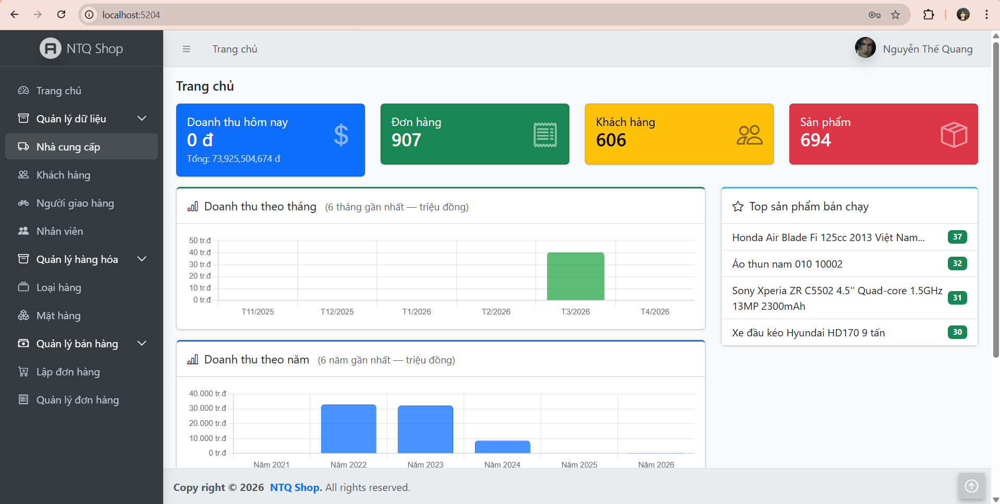
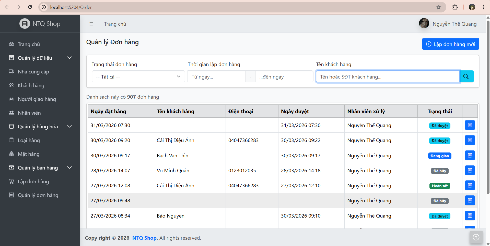
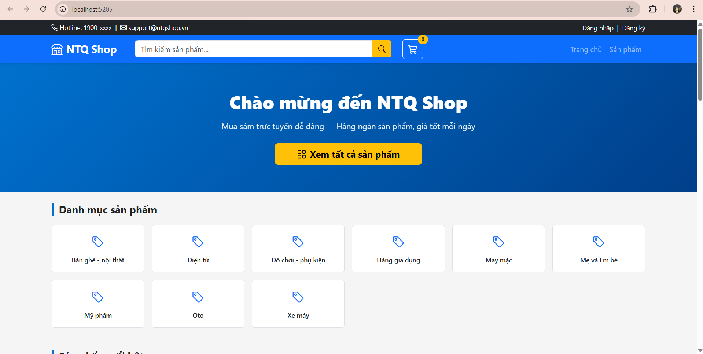
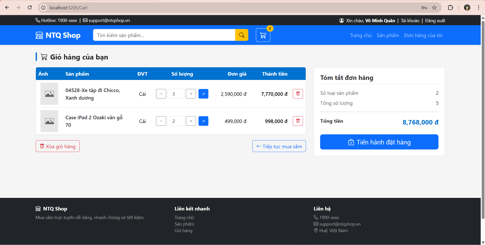

```markdown
# LiteCommerce Web

<div style="display: flex; align-items: center; gap: 20px;">
  <div>
    
    
    
    
  </div>
</div>

- Hệ thống thương mại điện tử đơn giản gồm **2 website**: trang quản trị (Admin) dành cho nhân viên và trang bán hàng (Shop) dành cho khách hàng. Xây dựng bằng **ASP.NET Core MVC**, kết nối **SQL Server** qua **Dapper**.

---

## Table of Contents

- [Features](#features)
- [User Interface](#user-interface)
- [Screenshots](#screenshots)
- [How to Run This App](#how-to-run-this-app)
  - [Prerequisites](#i-prerequisites)
  - [Setup](#ii-setup)
  - [Run App](#iii-run-app)
- [Error](#error)
- [Time Tracking](#time-tracking)
- [Future Work](#future-work)

---

## Features

### Admin Website (`SV22T1020362.Admin`)
| Chức năng | Mô tả |
|---|---|
| Đăng nhập / Đăng xuất | Xác thực nhân viên qua Cookie Authentication |
| Quản lý nhân viên | CRUD, đổi mật khẩu, phân quyền (Admin / DataManager / Sales) |
| Quản lý nhà cung cấp | CRUD nhà cung cấp |
| Quản lý khách hàng | CRUD, khóa/mở tài khoản, đổi mật khẩu |
| Quản lý người giao hàng | CRUD người giao hàng |
| Quản lý loại hàng | CRUD danh mục sản phẩm |
| Quản lý mặt hàng | CRUD sản phẩm, thuộc tính, thư viện ảnh |
| Quản lý đơn hàng | Lập đơn, duyệt, từ chối, giao hàng, hoàn tất, hủy |
| Dashboard | Thống kê doanh thu theo tháng & năm, top sản phẩm bán chạy |

### Shop Website (`SV22T1020362.Shop`)
| Chức năng | Mô tả |
|---|---|
| Đăng ký / Đăng nhập | Tài khoản khách hàng |
| Trang chủ | Hiển thị danh mục và sản phẩm nổi bật |
| Tìm kiếm & lọc | Lọc theo danh mục, tên, khoảng giá — AJAX phân trang |
| Chi tiết sản phẩm | Thư viện ảnh, thuộc tính, sản phẩm liên quan |
| Giỏ hàng | Lưu Session (chưa đăng nhập) hoặc CSDL (đã đăng nhập), merge khi đăng nhập |
| Đặt hàng (Checkout) | Chọn địa chỉ giao hàng, xác nhận đơn |
| Lịch sử đơn hàng | Xem danh sách và chi tiết đơn hàng cá nhân |
| Tài khoản | Cập nhật thông tin cá nhân, đổi mật khẩu |

---

## User Interface

### Admin
- Sử dụng theme **AdminLTE 4** + **Bootstrap 5** + **Bootstrap Icons**
- Sidebar điều hướng, modal dùng chung, AJAX phân trang
- Flatpickr cho date picker, AutoNumeric cho input tiền tệ

### Shop
- Giao diện tự thiết kế theo phong cách **Walmart** — **không dùng AdminLTE**
- Responsive, hero banner, product card, sidebar danh mục
- AJAX tìm kiếm sản phẩm và lịch sử đơn hàng

---

## Screenshots
| Admin — Dashboard | Admin — Quản lý đơn hàng |
|---|---|
|  |  |

| Shop — Trang chủ | Shop — Giỏ hàng |
|---|---|
|  |  |

---

## How to Run This App

### I. Prerequisites

| Yêu cầu | Phiên bản |
|---|---|
| Windows | 10 / 11 |
| Visual Studio | 2022 (ASP.NET workload) |
| SQL Server | 2014 trở lên (Developer / Express) |
| .NET SDK | 8.0 trở lên |
| SQL Server Management Studio | Tùy chọn (khuyến nghị) |

---

### II. Setup

**1. Clone repository**
```bash
git clone https://github.com/thequang-ntq/LiteCommerceWeb_learningHUSC
```

**2. Tạo database**

Mở **SQL Server Management Studio**, kết nối đến server rồi chạy file script:
```
/database/LiteCommerceDB_Update2026.sql
```

**3. Cấu hình connection string**

Mở 2 file `appsettings.json` (Admin và Shop), kiểm tra và cập nhật thông tin kết nối:

```json
// SV22T1020362.Admin/appsettings.json
// SV22T1020362.Shop/appsettings.json
"ConnectionStrings": {
  "LiteCommerceDB": "Server=.;Database=LiteCommerceDB;User Id=sa;Password=<your-password>;TrustServerCertificate=True;"
}
```

**4. Tạo thư mục ảnh** *(nếu chưa có)*

```
SV22T1020362.Admin/wwwroot/images/employees/
SV22T1020362.Admin/wwwroot/images/products/
```

Đặt file ảnh mặc định `nophoto.png` vào cả 2 thư mục trên.

**5. Thêm tài khoản Admin đầu tiên** *(chạy trực tiếp trên SQL Server)*

```sql
-- Mật khẩu mặc định: 123456 (đã hash MD5)
INSERT INTO Employees (FullName, Email, Password, IsWorking, RoleNames)
VALUES (N'Quản trị viên', 'admin@litecommerce.vn',
        'e10adc3949ba59abbe56e057f20f883e', 1, 'admin');
```

---

### III. Run App

**Cách 1 — Visual Studio 2022**

1. Mở file `SV22T1020362.sln`
2. Build -> Build Solution
3. Đặt Release -> Any CPU -> SV22T1020362.Admin -> http -> Bấm nút mũi tên xanh lá để chạy. Tương tự với SV22T1020362.Shop

**Cách 2 — Command Line**

```bash
# Terminal 1 — Admin
cd SV22T1020362.Admin
dotnet run

# Terminal 2 — Shop
cd SV22T1020362.Shop
dotnet run
```

**URL mặc định**

| Website | URL |
|---|---|
| Admin | http://localhost:5204 |
| Shop | http://localhost:5205 |

---

## Error

| Lỗi | Nguyên nhân | Cách xử lý |
|---|---|---|
| `ConnectionString not found` | Sai chuỗi kết nối trong `appsettings.json` | Kiểm tra `Server`, `User Id`, `Password` |
| `Login failed for user 'sa'` | SQL Server chưa bật SQL Authentication | Bật **Mixed Mode** trong SQL Server Properties |
| `Cannot open database` | Chưa chạy script tạo DB | Chạy lại `LiteCommerceDB.sql` |
| Ảnh không hiển thị bên Shop | Thiếu thư mục hoặc chưa sync ảnh | Kiểm tra `ShopWwwRoot` trong `appsettings.json` Admin |
| `clearFilter is not defined` | Script load qua AJAX không vào global scope | Đã sửa — hàm đặt trong `Index.cshtml` |

---

## Time Tracking

| Giai đoạn | Nội dung | Thời gian |
|---|---|---|
| Tuần 1-2 | Thiết kế CSDL, Models, DataLayers |
| Tuần 3-4 | BusinessLayers, Admin — Auth, CRUD danh mục |
| Tuần 5 | Admin — Quản lý đơn hàng, giỏ hàng session |
| Tuần 6 | Shop — Trang chủ, sản phẩm, giỏ hàng, checkout |
| Tuần 7 | Dashboard, biểu đồ, top sản phẩm, fix bug |

---

## Future Work

- [ ] Phân trang server-side cho lịch sử đơn hàng Shop
- [ ] Upload nhiều ảnh cùng lúc cho sản phẩm
- [ ] Gửi email xác nhận đơn hàng tự động
- [ ] Tích hợp thanh toán online (VNPay / MoMo)
- [ ] Báo cáo doanh thu xuất file Excel / PDF
- [ ] Đánh giá sản phẩm (rating & review)
- [ ] Tìm kiếm gợi ý (autocomplete) phía Shop
- [ ] Triển khai lên hosting / Docker
